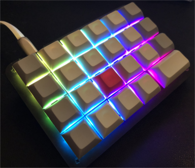

<!-- -*- mode: markdown; coding: utf-8 -*- -->

# Koolertron AMAG23 keyboard



  - [Motivations](#motivations)
  - [Keymap compression approach](#keymap-compression-approach)
  - [Simulated Modified key](#simulated-modified-key)
  - [Tap or Hold stroking](#tap-or-hold-stroking)
  - [Latest keymap for Genshin Impact](#latest-keymap-for-genshin-impact)

## Motivations

You can use this small keyboard immediately after purchasing it
by using the included software to define your preferred key layout.
I think many people love using this for PC games.
For a while, I also used the included software to play games
such as the PC version of [Genshin Impact](https://genshin.hoyoverse.com/).

In fact, it's comfortable to play the game with this keyboard,
which has been adjusted to my preferred keymap.
However, there are some problems, just like:

  - Standard Alt + number combination key definition doesn't work,
  - Three layers are required to map all functions,
    resulting in a lot of loss when switching layers, and so on.

The former could be handled by macro definitions,
but nothing could be done about the latter.

Therefore, while looking for a way to compress keymaps,
then I learned about [QMK Firmware](https://docs.qmk.fm/),
and was inspired by its approach
to multifunctionality for various compact keyboards,
so I decided to try QMK.

## Keymap compression approach

To reduce keymap layers, we need to assign multiple functions
(command keys in games) to a single key.
QMK tap dance and tap hold features are good options for this.
Key combination of normal key and layer switching key is very unique.

However, it seems that the key to hold can only be used
in combination with modifier keys such as Shift and Ctrl.

Therefore, I decided to rewrite the behavior of existing key codes that are not used.
I used the following as a reference.

  - [Customizing Functionality](https://docs.qmk.fm/#/custom_quantum_functions)
  - [Macros](https://docs.qmk.fm/#/feature_macros)

## Simulated Modified key

This is a very simple implementation for a key pressing with modifier key.
Genshin Impact doesn't seem that
a generic `LALT(KC_*)` definition is recognized correct key sequence.
Since It uses that LALT key is used for another special action,
it might be having special timing to be treated.
Of course, we can use the macro key sequence to do resolution instead.

This implementaton simulates that
human being pressing LALT and another generic key.
Using the timer having a short interval,
I can press a key with short delayed after pressing a modifier key.
Typical timings are shown below:

```
kc is pressed then released after the term:
     TIMER -.
------------+-----------------
== kc ======|=========|
== kc1 =====|=========|
            |== kc2 ==|
------------+---------+-------
            |         `- kc2 and kc1 release by real kc release
            `- kc2 press by timer

kc is pressed then released with in the term:
     TIMER -.
------------+-----------------
== kc ===|  |
== kc1 ==|  |
---------+--+-----------------
         `- kc1 release by real kc release
```

The kc1 will be pressed with actual key kc pressing,
and will be followed by kc2 pressing by timer with short delay.
Then, they will be released by actual key kc releasing.
The second timing is the case of cancellation.
If the key kc would be released within short time, no  kc2 will be pressed.

See [source.c](source.c) for more detail implementation.

## Tap or Hold stroking

This is a main implementation to reduce the key usage.
It makes an actual key can have two  different keys' functionalities.
The selection of keys will be determined by the timing of target key release.
The difference in usage is whether we tap the key quickly or press it for a little longer.
It is very simple.
The implementation is just a little complex in contrast.
Typical timings are shown below:

```
kc is pressed then released with in the term:
 WATCH TIMER -.   .- HOLD TIMER (start @ kc release)
--------------+---+---------------
== kc ==|     |   |  (quick pressed kc within hold time will be ignored)
== kc0 =|=========|
        |== kc1 ==|
--------+-----+---+---------------
        |         `- kc1 and kc0 release by hold timer
        `- kc1 press by kc release

kc is pressed then released after the term:
 WATCH TIMER -.
--------------+-------------------
== kc ========|============|
== kc0 =======|============|
              |== kc2 =====|  (kc2 can be null keycode)
--------------+------------+------
              |            `- kc2 and kc0 release by kc release
              `- kc2 press by watch timer
```

Since, the selection of key is determined at releasing key,
nothing to do at the pressing key (excluding modifier key kc0).
At that point, all we have to do is start measuring the key press time.
The single releasing key event will be rebuilt
into pressing event and releasing event of one desired key
with the help of timer.
As you can see from these timing diagrams,
there are constraints on the functionalities of kc1 and kc2 keys like followings:

  - The both of keys have a little delayed (this is a big problem for gaming), and
  - The key kc2 can be used for long pressing, but kc1 key cannot.

For the above reasons, these keys should generally be used
to compress simple command keys such as menu screen calls.
However, I think the benefits of compressing the number of keys
to 1/2 of the conventional size are very great.

See [source.c](source.c) for more detail implementation.

## Latest keymap for Genshin Impact

### Layer 0

A or B means tapping key for A, or holding (longer tapping) key for B.

```
+------------+--------+--------+--------+--------+--------+
|    ESC     | B or P | L or O | M or Y | C or G | J or U |
+------------+--------+--------+--------+--------+--------+
|    TAB     |   Q    |   E    |   R    |   Z    |   V    |
+------------+--------+--------+--------+--------+--------+
|   MO(1)    |   A    |   W    |   D    |   T    |  func  |
+------------+--------+--------+--------+--------+--------+
| X or MO(2) |  SPC   |   S    |  LCTL  |    F or BTN1    |
+------------+--------+--------+--------+-----------------+
(func = LALT,ENT or LALT)
```

### Layer 1

A,B means pressing A followed by B, then releasing them simultaneously.

```
+------------+--------+--------+--------+--------+--------+
|     Up     | LALT,1 | LALT,2 | LALT,3 | LALT,4 | LALT,5 |
+------------+--------+--------+--------+--------+--------+
|    Down    |   1    |   2    |   3    |   4    |   5    |
+------------+--------+--------+--------+--------+--------+
|    THRU    |   6    |   7    |   8    |   9    |   0    |
+------------+--------+--------+--------+--------+--------+
|   ENTER    |  BSP   |  Left  | Right  |     special     |
+------------+--------+--------+--------+-----------------+
(special = not implemented yet...)
```

### Layer 2

```
+------------+--------+--------+--------+--------+--------+
| RGB mode R |  Mod+  |  Hue+  |  Sat+  |  Brt+  |  Eff+  |
+------------+--------+--------+--------+--------+--------+
| RGB mode K |  Mod-  |  Hue-  |  Sat-  |  Brt-  |  Eff-  |
+------------+--------+--------+--------+--------+--------+
|     F9     |   F1   |   F2   |   F3   |   F4   |   F5   |
+------------+--------+--------+--------+--------+--------+
|    THRU    |   F6   |   F7   |   F8   |    RGB Toggle   |
+------------+--------+--------+--------+-----------------+
```

### Keymap definition

You can use the site [QMK Configurator](https://config.qmk.fm/#/amag23/LAYOUT)
with my [kitcnya.json](https://raw.githubusercontent.com/kitcnya/amag23/master/kitcnya.json) file.
